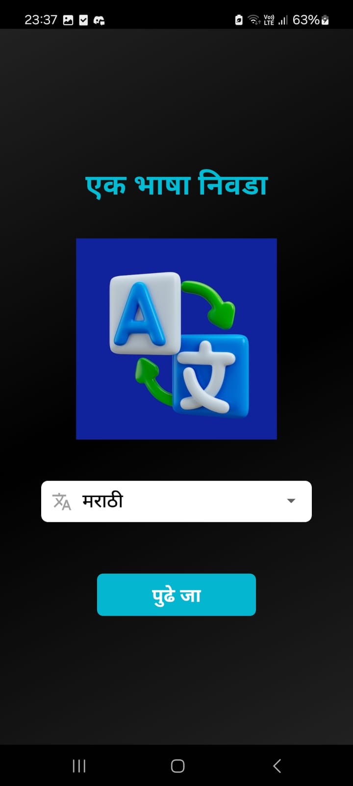
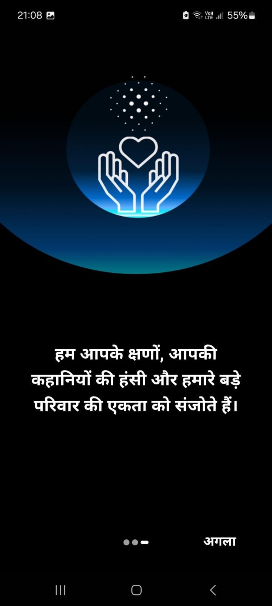
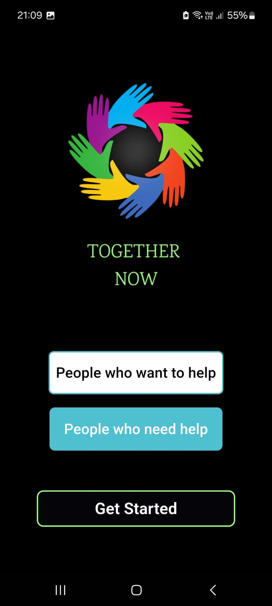
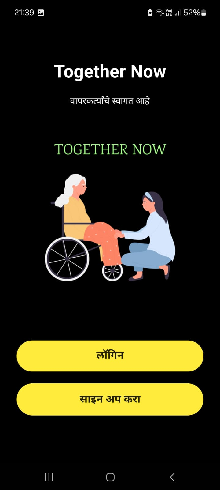
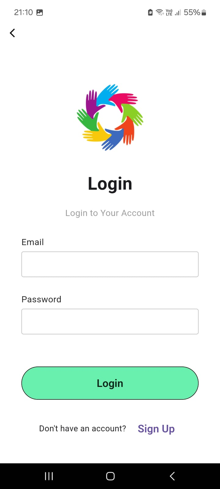
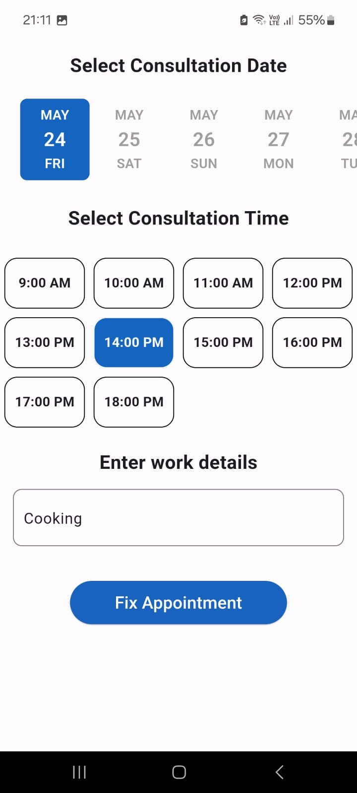
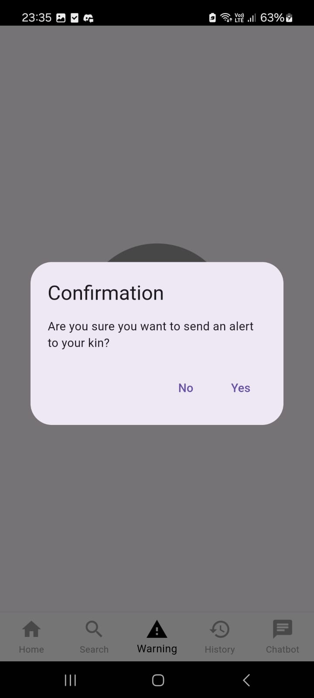
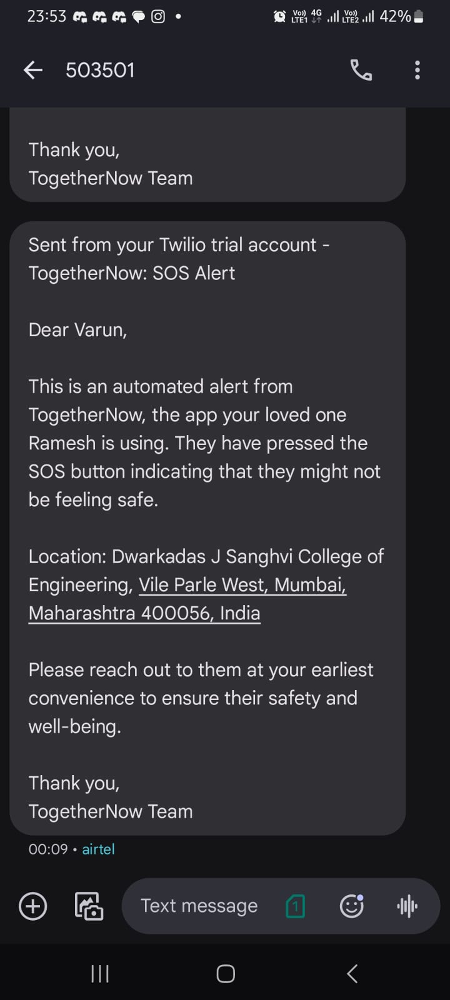
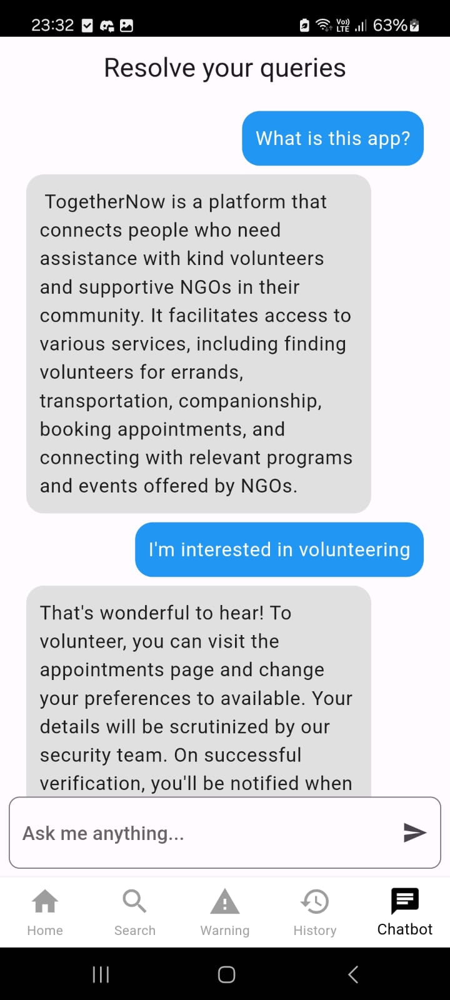
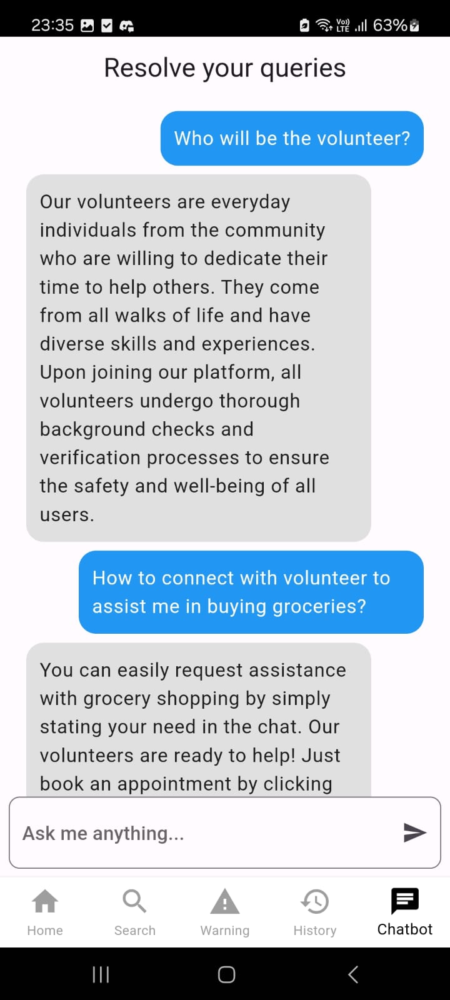

# Together Now

The application aims to address the challenges faced by the elderly population by connecting them with willing volunteers through a secure and technologically advanced platform. It verifies volunteers' identities, employs GPS tracking for safety, and utilizes AI to match volunteers with tasks based on their skills and the needs of the elderly. A real-time review system fosters accountability and trust. Ultimately, the goal is to combat elderly isolation and help them while fostering a sense of community and support between generations.

## Features

- Cross platform app available for both Android and iOS
- Multingual Support for all user groups
- Firebase authentication for login
- A personalized chatbot for answering all your queries regarding  our application
- SOS functionality to send SMS to kin of person in case of any emergencies
- Facility to book an appointment for a task

## ML and Technology

Together Now leverages several advanced machine learning techniques to ensure seamless user experiences:

- **CV-Based Aadhar Verification**: To enhance security and prevent fraud, the app employs computer vision (CV) techniques to verify volunteers' identities by scanning and authenticating their Aadhar cards, ensuring that only verified individuals can participate.

- **Recommendation System**: The app features a recommendation engine that matches volunteers with elderly individuals based on mutual preferences and needs:
  - **Content-Based Filtering** and **Collaborative Filtering** are used to personalize suggestions, powered by **LightFM** and **Singular Value Decomposition (SVD)** algorithms. These approaches ensure that volunteers are paired with the elderly based on both shared interests and historical data.

- **Reinforcement Learning for Feedback**: A reinforcement learning loop is incorporated into the system by analyzing the sentiment of the reviews provided for volunteers. The sentiment analysis helps adjust future volunteer recommendations by feeding this information back into the matching algorithm, ensuring better, more reliable pairings over time.

## Screenshots
### App

**The app is available for both iOS and Android.**

  
  

  
  

  
  

  
  

  
  

  

